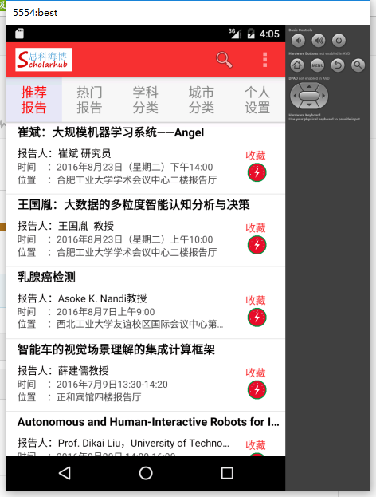

# 为了帮老师参赛做的一个展示用途的安卓app -- sike

------

算是入门安卓开发的一个小作品吧，因为当时也是参赛作品主要是网站端，而安卓端主要是为了大致的展示，所以样子确实有点简陋^_^

在远程服务器后端我是用php做的数据端口，然后在安卓端使用okhttp对服务器进行请求。

### 主要用到外部库有:

> * Eventbus
> * Okhttp

### 运行截图

